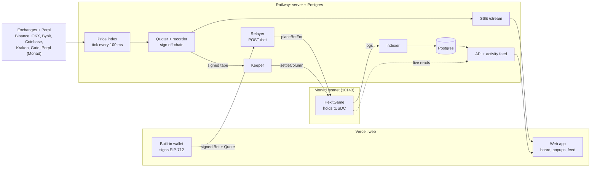

# Hexit

**HEXIT THE RANGE.**

Hexit is a tap-trading game that runs as a web app on **Monad testnet** (chain 10143). The board is a honeycomb of hexagons laid over time and price. Double-tap a hex to stake test USDC. If the live price line enters that hex, it goes BOOM and pays stake × multiplier.

Every tap is a real Monad testnet transaction. Players never need MON for gas, because Hexit's server pays it.

Status: live since 2026-10-09. The BTC and MON markets went live on 2026-10-10.

## Live links

| What | Link |
|---|---|
| Website (home, how it works, markets, leaderboard, FAQ) | https://hexit-app.vercel.app |
| The game | https://hexit-app.vercel.app/play |
| Server health | https://hexit-game-production.up.railway.app/health |
| Server config (addresses, markets, limits) | https://hexit-game-production.up.railway.app/config |
| `HexitGame` contract (proxy) | https://testnet.monadvision.com/address/0xe1341560B697EC40c9fa2e1e6EF270bF6b59fE39 |
| `TestUSDC` token (proxy) | https://testnet.monadvision.com/address/0x674aD889D8870B5d69dc7d47da8f4e26a3fE3119 |

## Architecture

The web app is static files on Vercel. Everything else except the contract runs in one Node process, `services/game`, on Railway, next to a Railway Postgres. Only bets and settlements touch the chain; quotes and price tapes are signed off-chain.

The full high-level architecture (the life of a tap, settlement, prices and odds, trust and safety, deployment, failure modes) is in [`docs/ARCHITECTURE.md`](docs/ARCHITECTURE.md).



## Project structure

```text
hexit/
├── app/                     web app, deployed to Vercel; node build.mjs writes app/dist/
│   ├── index.html           the game (/play): canvas board, controls, popups, feed, profile, settings
│   ├── site/                website layout and page templates (home, how it works, markets, leaderboard, FAQ, legal)
│   ├── src/                 bundled scripts: chain.ts (wallet, API, popups, feed), site.ts, seams.ts, avatars.ts
│   ├── test/                unit tests for seams.ts
│   ├── fonts/ icons/ vendor/  self-hosted fonts, app icons, QR code library
│   ├── build.mjs            build; fills addresses and limits in from deployment/monad.json
│   └── vercel.json          clean URLs for the 9 pages, cache and security headers
├── contracts/               Foundry project; full reference in contracts/README.md
│   ├── src/                 HexitGame and TestUSDC (both UUPS), HexGeo geometry library
│   ├── test/                forge tests and fixtures
│   ├── script/              deploy, markets upgrade, gas bench
│   └── GAS.md               measured gas limits (gas.sh measures them)
├── packages/
│   ├── monad/               viem client for app and server: chain config, ABIs, EIP-712 signers, calldata, logs, gas limits
│   └── pricing/             hex pricing engine: win-probability solver, multipliers, quotes, integer settlement mirror
├── services/
│   └── game/                the server (Railway): price index, signing, relayer API, keeper, indexer, feed, SSE
├── deployment/
│   └── monad.json           public deployment record: chain, addresses, roles, parameters, markets
├── docs/
│   └── ARCHITECTURE.md      design, trust model, deployment and failure modes
├── research/
│   └── pricing/             pricing maths (HEX.md) and its reference implementation (hex_pricing.py)
├── tests/
│   └── vectors/             hex-segment and pricing vectors shared by the contract and pricing tests
├── brand/
│   ├── logo/                mark, app icon, full logo
│   └── build_cover.py       X header generator (with its HTML source and PNG renders)
└── LICENSE
```

`keys/` is gitignored and never committed; see "Security".

## How a round works

- **The board.** Flat-top hexagons tile a plane, with time running left to right and price running bottom to top.
  - A **column** is one vertical strip of hexes. Columns start 5 s apart.
  - Each hex is open for about 6.7 s (its **window**) and is one **price band** tall.
  - A band is $5 on BTC/USD and $0.00001 on MON/USD. Odd columns sit half a band higher than even ones.
- **The price line.** It is drawn from the live index, which makes one price point (a **tick**) every 100 ms. The ticks are joined by straight lines.
- **Placing a bet.**
  - Pick a stake, then double-tap (or double-click) a hex ahead of the lock line. Double tap is on by default; with it off, a single tap places the bet.
  - A hex can only be bet on if its window opens at least 6.1 s from now. Closer than that, it is **locked**.
- **The multiplier.**
  - Each hex shows its multiplier, from 1.01x to 100x. Far-away and unlikely hexes pay more.
  - The bet takes the multiplier from the server's signed price list (the **quote**). Your bet also sets a floor: the shown multiplier minus your slippage setting (20% by default). If the quoted multiplier is below that floor, the bet is refused.
- **BOOM.** If the price line enters your hex during its window, you win stake × multiplier.
  - The app shows the BOOM the moment the line touches the hex.
  - The chain settles it a second or two after the window ends, and the chain's result is final. If the chain saw no hit, the app corrects the entry and the balance follows the chain.
- **No hit.** If the line misses the hex, you lose the stake.
- **Refunds.** Missing price data is never a house win. The stake is refunded (a **VOID**) in two cases:
  - the price data has a hole longer than 250 ms before your hex was touched;
  - no settlement arrives within 120 s after the window ends. In that case anyone may void the column.
- **Limits.**
  - The contract accepts stakes from $0.10 to $50 per bet. The app currently offers $0.10 to $5 and refuses more than $25 per column.
  - The most a single bet can pay is $2,500.
  - A player can have up to 32 open bets.

## Features

- **Two markets on one balance:** BTC/USD and MON/USD.
  - Each market has its own board, quotes and settlement.
  - Switching market never cancels a bet; bets on the other market keep settling.
- **Every tap is on chain.** Bets, settlements, grants, deposits and withdrawals are all Monad testnet transactions.
  - Each one opens a popup on the right that links to `https://testnet.monadvision.com/tx/<hash>`.
  - The popup moves from pending to confirmed or failed.
- **Gasless built-in wallet.**
  - The browser creates a wallet key on first visit and signs every action on the device.
  - The relayer sends the transaction and pays the gas, so players need 0 MON.
- **$100 test USDC** for every new wallet, granted once on chain.
- **Live activity feed.** Real testnet entries and payouts from all players, each linking to its transaction.
  - It sits in the top-right corner of the game, and the homepage shows the newest three.
- **Leaderboard:** all time, daily and weekly.
  - All time is computed from the chain.
  - Daily and weekly come from Postgres.
- **Full-screen desktop up to 4K.**
  - On desktop the board draws at native device pixels, with a top bar, a stake dock and side drawers.
  - Phones get their own touch layout.
  - Frame rate is 60 fps.
- **Instant BOOM.** The win fires from the live price line. Chain settlement confirms it afterwards.
- **Withdraw and add funds.**
  - Withdrawals pay only the wallet's own address and are never paused.
  - Deposits use a signed permit, so they need no gas either.

## Under the hood

### Words used below

| Term | Meaning |
|---|---|
| EIP-712 | A standard for signing structured data, so a contract can check exactly what was signed and by whom. |
| UUPS proxy | An upgradeable contract. Users talk to a fixed proxy address, and the owner can point it at new code. |
| Tape | The list of 100 ms ticks covering one column's window. |
| Quote | A signed list of 64 multipliers for one column, valid for 1.5 s. |
| Relayer | The server wallet that submits players' signed bets and pays their gas. |
| Keeper | The server wallet that sends the settlement transactions. |
| SSE | Server-sent events: one long HTTP response the server keeps writing updates to. |

### Data flow

Step by step through the diagram in "Architecture":

1. **Price index.**
   - The server listens to six exchanges plus Perpl (an order-book exchange on Monad, read over its public market-data API) and takes the median of their fresh prices every 100 ms.
   - Before the median, it drops crossed or wide order books and outliers.
   - Each market needs fresh prices from at least 4 venues. Without that, there is no tick, which leaves a hole in the tape.
   - Prices quoted in USDT are converted to USD with the Coinbase and Kraken USDT/USD rate.
   - Binance does not list MON, so MON uses six venues and BTC uses seven.
2. **Quotes.** The quoter prices the 18 columns on the board every 250 ms and signs them. The app shows these multipliers.
3. **Bets.**
   - The app signs an EIP-712 Bet and sends it to the relayer with the quote.
   - The relayer refuses it in two cases:
     - the price has moved more than a quarter band since the quote;
     - the newest tick is more than 1.5 s old.
   - It then simulates the transaction and sends `placeBetFor`.
   - The contract checks again: both signatures, the quote's age, the lock, the caps and the player's credit.
4. **Settlement.**
   - When a column's window ends, the recorder signs its tape.
   - About 1 s later the keeper calls `settleColumn` with that tape.
   - The contract checks the recorder's signature, the 100 ms grid, a per-market limit on how far the price may move per tick, and that the tape covers the whole window.
   - It then tests each segment of the line against each hex using integer-only geometry (`HexGeo`), and pays out.
5. **Reading.**
   - The indexer reads contract logs into Postgres, up to the finalized block.
   - Postgres serves the daily and weekly leaderboard and each player's history and transfers (`/leaderboard`, `/player/:addr/history`, `/player/:addr/transfers`).
   - Balances, open bets and the all-time leaderboard are read straight from the contract, not from Postgres (`/player/:addr`, `/leaderboard`).
   - The activity feed is an in-memory list, refilled from Postgres on restart (`/activity`).
   - The SSE stream (`/stream`) carries ticks, quotes and new activity to the board, the popups and the feed. Postgres keeps the history (bets, transfers, ticks) across restarts.

### Why pay per bet

On Monad testnet, gas is charged on the gas **limit** at a 100 gwei minimum base fee, and faucets give about 1 MON per day. Writing the 100 ms price tape on chain would cost 70 to 160 MON per active hour.

So the tape and the quotes are signed off-chain, and they only reach the chain inside the transactions that need them:
- a bet carries its signed quote;
- a settlement carries its column's signed tape.

Idle time costs nothing. Only columns with bets are settled.

Rough costs at 102 gwei, from [`contracts/GAS.md`](contracts/GAS.md):

| Transaction | MON |
|---|---|
| Bet | 0.011 to 0.018 |
| Settling one column | about 0.05 |
| New-player grant | about 0.048 |

## Pricing in one paragraph

- **Winning:** you win if the price line enters the hexagon. The line is the 100 ms ticks joined by straight lines.
- **Win chance:**
  - One backward solve per volatility level gives the win probability for every hex.
  - Fat tails come from a mix of volatilities: 1, 1.5 and 3 times normal, weighted 0.6, 0.3 and 0.1.
- **Multiplier:**
  - It is (1 − edge) ÷ P, where P is the win probability.
  - It is rounded down to 3 significant figures and capped at 100x.
  - Nothing under 1.01x is offered.
- **Locking:** a hex locks before its window opens.
- **Refunds:** missing price data refunds a bet; it is never a house win.
- **Placeholders:** the house edge (8%) and the tail weights are placeholders until they are calibrated.

## Contracts and addresses

Monad testnet, chain 10143. Both contracts sit behind UUPS proxies, so the addresses players use never change.

| Contract | Proxy (use this) | Current implementation |
|---|---|---|
| `HexitGame` | `0xe1341560B697EC40c9fa2e1e6EF270bF6b59fE39` | `0x87381edaB38eE1A7B22E6D952d11E03Fa666724B` (the markets upgrade, 2026-10-10) |
| `TestUSDC` (tUSDC, 6 decimals) | `0x674aD889D8870B5d69dc7d47da8f4e26a3fE3119` | `0x15Ad542bFAA6A79f470BfA691Ce4d9f00b2b96A5` |

- `HexitGame` holds the house funds, all player credit and all open stakes in tUSDC, and runs the bets, caps and settlement for every market. tUSDC a player withdraws sits in that player's own wallet.
- After every token movement it checks that its tUSDC balance covers the house funds, all player credit and all open stakes.

| Market | Asset id | Band | Status |
|---|---|---|---|
| BTC/USD | 1 | $5 | Live |
| MON/USD | 3 | $0.00001 | Live |

| Role | Address | What it can do |
|---|---|---|
| admin (owner) | `0x80A13649181682Ded1b080822f30c2A7B977BD53` | Upgrade, set parameters and markets, pause and unpause, move house funds |
| guardian | `0x815D4107D06550fA4dED308c64840e7Ad89DF151` | Pause play or deposits, and disable a recorder. Nothing else |
| relayer | `0x20df2Af4E74DC889eC6cEAcb089faD8B5a1d36A6` | The only sender allowed to call `placeBetFor`. Sends grants, and submits players' signed deposits and withdrawals. Pays the gas |
| quoter | `0x78774441a9514F68e042be1fe7AB53cBf380C3bd` | Signs quotes off-chain. Holds no MON |
| recorder | `0x204E9C68b9E6da4A0506886892Dd36A0da08738D` | Signs column tapes off-chain. Holds no MON |
| keeper | `0x6628466DA25dc84516c52a79F3089aCEE4051220` | Sends `settleColumn` and `voidColumn`. These calls are open to anyone; the keeper is simply the server's sender |

The full function, event and parameter reference is in [`contracts/README.md`](contracts/README.md).

## Quick start

**Prerequisites:**
- Node 22.18 or later.
- Foundry 1.8.5 or later. The contract tests and the `packages/monad` tests run `forge` and a local `anvil`.
- Docker, only for the server's end-to-end test.

Install and test each package in this order, from the repository root. `packages/monad` must be installed before the app is built, so the app bundles a single copy of viem.

```sh
(cd contracts && npm ci && forge test)               # 86 tests, about 20 s; npm run validate checks upgrade safety
(cd packages/pricing && npm ci && npm test)          # 15 tests
(cd packages/monad && npm ci && npm test)            # 4 tests (one runs every signed message on a local anvil)
(cd services/game && npm ci && npm test)             # 24 tests; npm run typecheck type-checks
(cd app && npm ci && npm test && node build.mjs)     # 9 tests; the build goes to app/dist
```

Notes:
- **Packages.** The app, the server and the Docker image load `packages/monad` and `packages/pricing` from their `dist/` folders. After changing either package, run `npm run build` in it.
- **API address.** The app talks to the live Railway API by default. To use a local server, build with `HEXIT_API=http://localhost:8788 node build.mjs`.
- **End-to-end test.**
  - `cd services/game && npm run e2e` runs the whole stack locally: anvil, a throwaway Postgres in Docker, the contracts and the server with throwaway keys.
  - It needs a built `contracts/out`.
  - Run it with any `HEXIT_RPC_*` and `HEXIT_CORS_*` variables unset, because it passes your shell environment through.
- **Never start the server against testnet.** The live server on Railway keeps the relayer's and keeper's transaction counters (nonces) in memory, and a second copy breaks them.

## Deploy

The deploy overview is in [`docs/ARCHITECTURE.md`](docs/ARCHITECTURE.md) (section 9). The contract deploy and upgrade steps are in [`contracts/README.md`](contracts/README.md). In short:
- the server deploys to Railway from a `git archive` export, as one replica;
- the website deploys as `app/dist` to Vercel;
- contract upgrades go through UUPS after `npm run validate`.

## Known limits

- **Testnet only.** tUSDC is play money with no value.
- **The wallet key lives in browser storage** (`localStorage`) for this site's address. Clearing site data loses it.
- **The email, Google and X sign-in screens are cosmetic.** There is no account system.
- **Settings reset on reload.** Several Settings rows have no handler yet: export key, wallet history, social links, delete account and push notifications.
- **Placeholders.** The house edge and tail weights are placeholders.

## Security

- **No private keys in the repo.**
  - `keys/` and `.env` files are gitignored.
  - Never print a key or paste one into a file, a log or a chat.
- **Admin and guardian keys are kept off the server.** The server never loads them.
- **The server loads only four keys:** recorder, quoter, relayer and keeper.
  - They come from sealed Railway variables (`HEXIT_KEY_<ROLE>`), or locally from `keys/monad/<role>.json`.
  - The server checks each derived address against `deployment/monad.json` (and, on testnet, a fixed table in the code), and refuses to start on any mismatch.
  - Its error messages never include key text.
- **Players' money rules are enforced by the contract.**
  - Withdrawals always pay the player's own address and cannot be paused.
  - The guardian can only stop things, never move funds.
  - Missing price data refunds bets.

## Licence

Copyright (c) 2026 Penguin Pecker. All rights reserved. The code is published for reference only, and no licence is granted to use, copy, modify or distribute any part of it without prior written permission. See [`LICENSE`](LICENSE).
