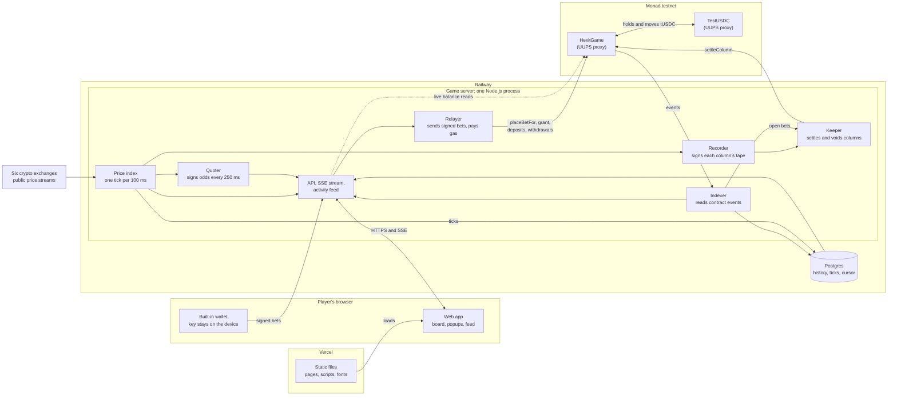
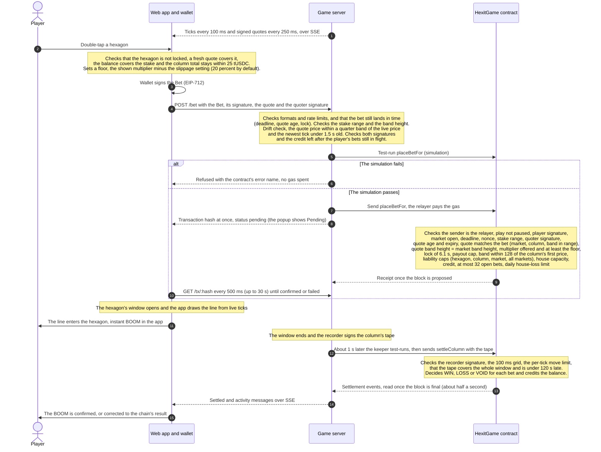
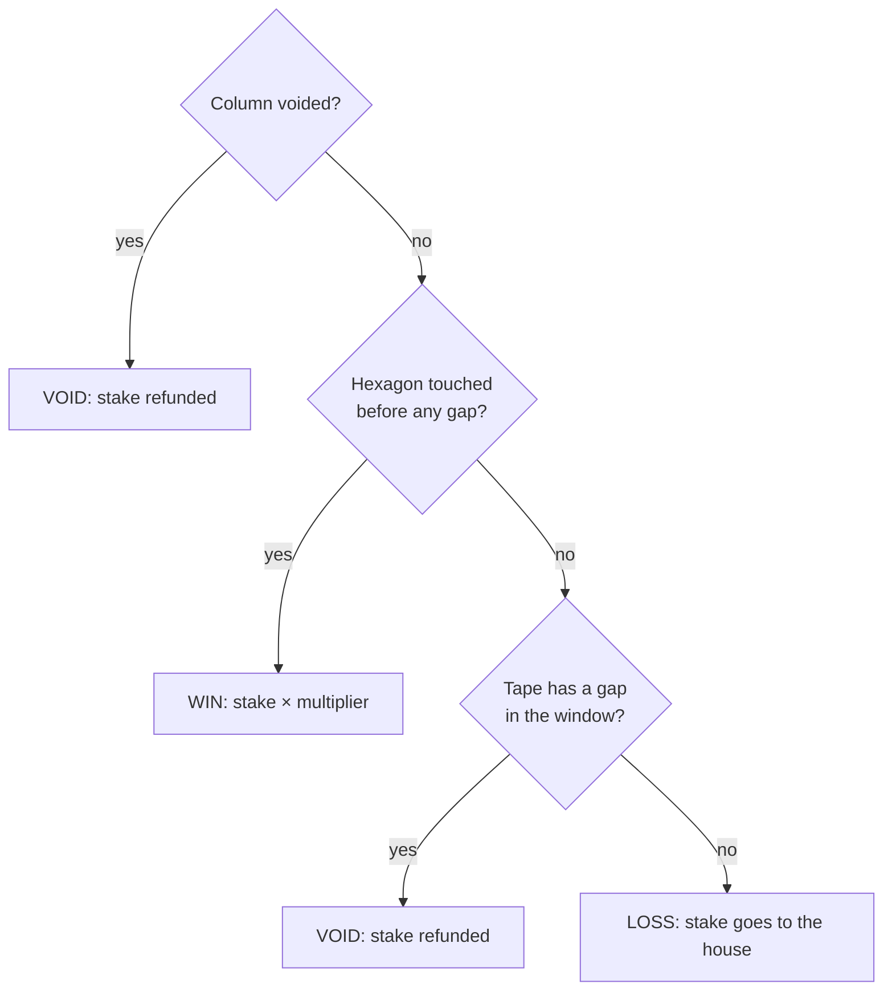
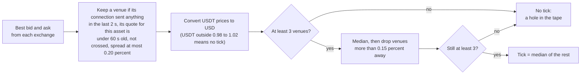
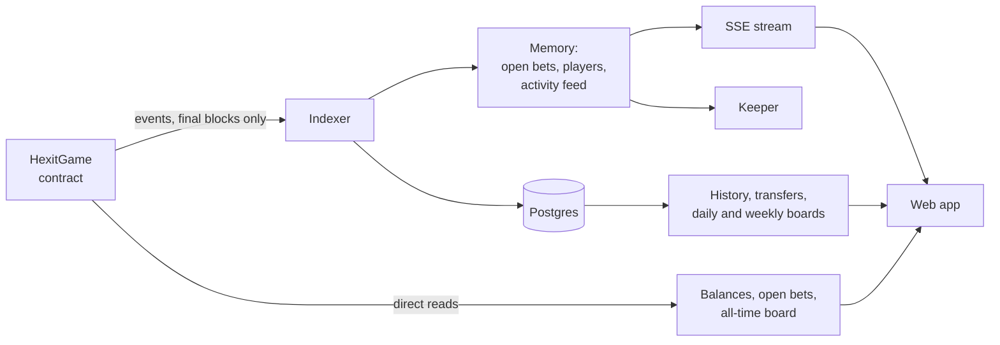

# Hexit on Monad: architecture

This document explains how the Monad version of Hexit is built: what runs where, how a bet travels from a tap to a payout, and which parts you have to trust. It is written for a technical reader who is not a blockchain developer, so each term is explained the first time it appears. Every fact comes from the code, configuration and gas measurements in this repository; each section ends with a "Where to look" line.

Comments in the code that cite `DECISIONS.md`, `SPEC-MONAD.md` or `HANDOFF` refer to internal design notes that are not published; this document covers that design.

## 1. What Hexit is

Hexit is a tap-trading game played in a web browser. The board is a honeycomb of hexagons laid over a chart: time runs left to right and price runs bottom to top. A live price line (Bitcoin or Monad's MON token, both priced in US dollars) moves across it. The player picks a stake and double-taps a hexagon ahead of the line. If the line passes through that hexagon during its time window, the hexagon goes **BOOM** and pays the stake times the multiplier printed on it. If the line misses, the stake is lost. Hexagons far from the line are unlikely to be hit, so they pay more, up to 100×.

Every bet is a real transaction on **Monad testnet**, a public test network of the Monad blockchain. A **blockchain** is a shared public ledger kept by many computers, and a **smart contract** is a program stored on it that holds money and enforces its rules where anyone can check them. Bets are made in test USDC (**tUSDC**), a play-money token with no value that Hexit issues itself; every new player gets 100 tUSDC once. Sending a transaction costs a fee called **gas**, paid in MON, the network's own currency. Players never need any MON, because Hexit's server sends their transactions and pays the gas for them.

Where to look: `README.md`, `deployment/monad.json`.

## 2. The pieces at a glance

| Piece | Runs on | What it does |
|---|---|---|
| Web app | Static files served by Vercel, running in the player's browser | Draws the board on a canvas (full screen up to 4K on desktop, a touch layout on phones), shows a popup for every transaction with a link to the block explorer, and shows the activity feed, profile and leaderboard. It talks only to the game server's API, never directly to the blockchain. |
| Built-in wallet | The player's browser | A **private key** (the secret that proves who signed something) created when the player first starts playing and kept in the browser's local storage. It signs bets, withdrawals and deposits on the device. The key is never sent anywhere. |
| Price index | Game server | Listens to six exchanges and produces one price, a **tick**, per market every 100 ms. |
| Quoter | Game server | Every 250 ms prices the visible board (18 columns × 64 hexagons per market) and signs the multipliers. |
| Recorder | Game server | When a column's time window has passed, signs that column's list of ticks, its **tape**. |
| Relayer | Game server | Checks each signed bet, test-runs it, and sends it to the contract, paying the gas. Also sends the one-time grant and players' signed deposits and withdrawals. |
| Keeper | Game server | About 1 s after a column's window ends, sends its settlement with the signed tape. Refunds columns that could not be settled in time. |
| Indexer | Game server | Reads the contract's **events** (the public log entries a contract writes as it runs) up to the newest final block, into memory and Postgres. |
| Stream and activity feed | Game server | One **SSE** connection (server-sent events: a long HTTP response the server keeps writing to) per browser carries ticks, quotes, game events, and a feed of every player's real bets and payouts. |
| API | Game server | HTTP routes for configuration, balances, history, leaderboards, transaction status, and the relayed actions (`/onboard`, `/bet`, `/withdraw`, `/deposit`). |
| Postgres | Railway, next to the server | A database for bet history, transfers, grants, recent ticks and the indexer's position. Optional: without it the game still runs, minus history and the daily and weekly boards. |
| HexitGame | Monad testnet | The game contract. It holds all tUSDC (house funds, player balances, open stakes), checks every bet, decides every column and pays out. |
| TestUSDC | Monad testnet | The play-money token (6 decimals). It supports **permits**, signed approvals that let a deposit happen without the player paying gas. Only the owner and owner-approved minters (the game, for grants) can create new tokens. |

Both contracts sit behind **UUPS proxies**. A proxy is a small contract with a fixed address that forwards every call to a separate code contract (the implementation). The owner can point the proxy at new code, so the address players use never changes (section 9).

All server jobs live in one Node.js process on purpose: the relayer and the keeper must each number their own transactions in strict order, which only works with a single copy running (section 9).

Where to look: `services/game/src/main.ts`, `app/src/chain.ts`, `contracts/src/`, `deployment/monad.json`.

## 3. Life of a tap

The diagram follows one bet from the double-tap to the payout. Two kinds of signature appear in it. An **EIP-712 signature** is a signature over a structured message (for example "player X bets stake S on hexagon (column k, band j)"), so the contract can check exactly what was signed and by whom. The player's wallet signs the bet, and the server's quoter key has already signed the multipliers the bet relies on.

The checks that matter most:

| Check | Where | What it protects |
|---|---|---|
| Quote signature and age | Relayer and contract | Only multipliers signed by the quoter key count, and a quote is good for 1.5 s. The contract measures the age against the block's own clock. |
| Lock | App, relayer and contract | A hexagon can be bet on only if its window opens at least 6.1 s after the later of the quote's time and the current time (5.1 s plus a 1 s margin). Nobody can bet on a hexagon the line is about to reach. |
| Caps | Contract | Stake 0.10 to 50 tUSDC; at most 2,500 tUSDC payout per bet; liability caps per hexagon, per column, per market and across all markets; the house must be able to cover every open bet; at most 32 open bets per player; new bets halt after a daily house-loss limit. The app is stricter: stakes up to 5 tUSDC and 25 tUSDC per column. |
| Drift | Relayer only | The quote's reference price must be within a quarter band of the live price, and the newest tick under 1.5 s old. A player cannot pick an old quote after the price has moved. |
| Nonce and deadline | Contract | Each signed message carries a **nonce**, a number that can be used only once (from a sliding window of 32, so bets may land in any order), and a deadline (10 s out for a bet). A signed bet cannot be replayed or sent late. |
| Finality | Indexer | Monad confirms a block in stages. The relayer gets its receipt when the block is proposed; the indexer reads events only from blocks that are **final** (can no longer change), about half a second later. The feed, the keeper's list of open bets and the database follow final blocks. Balances are read live from the contract at the newest block (cached for 1 s) and refreshed when the player's transactions land. |
| Simulation | Relayer and keeper | On Monad a failed transaction still pays its whole gas limit, so every transaction is test-run first and a predictable failure is refused for free. |

Where to look: `app/index.html` (tap handling and the instant BOOM), `app/src/chain.ts`, `services/game/src/api.ts`, `contracts/src/HexitGame.sol` (`_placeBet`, `_book`).

## 4. Settlement

### The 100 ms tape

The price index makes one tick every 100 ms, on a fixed grid of times that are whole multiples of 100 ms. The price line is these ticks joined by straight lines. Each column of hexagons is numbered `k`. Columns start 5 s apart, and column `k`'s window runs from `5000k − 834` ms to `5000k + 5834` ms, about 6.7 s. Windows of neighbouring columns overlap because the hexagons interlock.

A column's **tape** is every tick from the last one at or before the window opens through the first one at or after it closes. The ticks never go on chain one by one. Once the window has passed, the recorder signs the whole tape as one EIP-712 message (`ColumnTape`: market, column, and a fingerprint of all its ticks).

### Settling a column

About 1 s after the window closes, the keeper calls `settleColumn` with the tape, its signature and the list of players who have open bets on that column. This happens only for columns that have bets, so an idle board costs nothing. The contract:

1. checks the tape has at least 2 ticks, with as many prices as times;
2. checks it arrives no more than 120 s after the window closed;
3. checks the last tick is at most 1 s ahead of the block's clock;
4. checks every tick sits on the 100 ms grid, times strictly increase, and each step stays within the market's move limit (the limit grows with the time between the two ticks);
5. checks the signature belongs to one of the allowed recorder keys and that the key has not been disabled;
6. checks the tape covers the whole window;
7. tests each straight segment of the line against each hexagon, using integer-only geometry so every computer gets exactly the same answer (the integer maths is mirrored in TypeScript in the pricing package and checked against the contract's test vectors);
8. stores which hexagons were touched, then settles each listed player's bets on that column.

The column is decided once. Later calls for the same column carry no tape and only settle more players; the keeper settles up to 20 players per transaction. The server publishes a column's signed tape only after the chain has decided that column, so nobody holding MON can use it to settle only the columns they won and leave the rest to be refunded.

### WIN, LOSS, VOID and the gap rule

A **gap** is any step between two ticks longer than 250 ms, which means at least two ticks in a row are missing. A single missing tick is bridged by a straight line, which can still touch hexagons. Touches before the gap still count. After a gap nothing more can be touched, and every bet in the column that was not already touched is refunded rather than lost. Missing data is never a house win.

### Void after 120 s

If no valid tape reaches the chain within 120 s after a column's window closes, `settleColumn` refuses it and anyone may call `voidColumn`, which refunds every open bet on that column. The keeper does this itself 122 s after the window closes. Settlement and voiding are open to anyone and can never be paused.

### Instant BOOM and the chain's final word

The app does not wait for the chain to celebrate. It runs a floating-point version of the same hexagon test, and the same 250 ms gap rule, on the live ticks it receives, and fires BOOM the moment the drawn line enters an armed hexagon. The chain decides from the signed tape a second or two after the window closes, and the chain's answer is final. If the two disagree, the app corrects the entry ("the chain saw no hit" or "settled as a refund"), and the balance always follows the contract.

Where to look: `contracts/src/HexitGame.sol` (`settleColumn`, `voidColumn`, `_applyTape`, `_settlePlayers`), `contracts/src/HexGeo.sol`, `services/game/src/tape.ts`, `services/game/src/keeper.ts`.

## 5. Prices and odds

### The multi-venue index

The server keeps public, keyless WebSocket connections to six exchanges (Binance, OKX, Bybit, Coinbase, Kraken and Gate) and reads each one's best bid and ask. Every 100 ms, for each market separately, it builds the tick as in the diagram. Some venues price in USDT, a dollar-pegged token; those prices are converted with a USDT/USD rate averaged over 60 s from the venues that price in dollars. Binance does not list MON, so MON draws on five venues and BTC on six; both need three. Prices are whole numbers in units of 10⁻⁸ dollars, and the index never copies a previous tick forward: an instant without agreement is simply missing. The index is deterministic, so replaying the same exchange messages gives the same ticks.

The server also refuses a tick that jumps further than the contract's per-tick move limit for that market, because a tape containing it could never be settled. The refused tick becomes a hole, which the gap rule turns into refunds.

### Quotes

Every 250 ms, per market, the quoter prices the next 18 columns that can still be bet on (the first one whose window opens at least 6.1 s ahead), 64 price bands each, centred on the current price. Each column's 64 multipliers are signed as one EIP-712 `Quote` that also names the market, the band height, the reference time and price, and an expiry 1.5 s after the reference time. The quotes go out on the stream and come back inside bets; the quoter itself never sends a transaction. If the newest tick is more than 300 ms old, the quoter stops, and the last quotes expire on their own.

### From win probability to multiplier

For each hexagon the engine computes the probability `P` that the line (100 ms ticks joined by straight lines) enters it during its window, given how long until the window opens and how volatile the price is. It does this with a numerical backward solve per volatility level, cached by volatility bucket so a quote costs little. Volatility is estimated live from the ticks, with a per-market floor. To allow for sudden jumps ("fat tails"), the probability is a blend of three volatility levels, 1×, 1.5× and 3× the estimate, weighted 0.6, 0.3 and 0.1. When short-term volatility runs well above the estimate, the board shifts one column further out.

The multiplier is `(1 − edge) ÷ P`, where the edge is the house's margin (a constant, `EDGE`, in the pricing package). It is rounded down to three significant figures, capped at 100×, and anything under 1.01× is not offered.

### Bands per market

The band height (how much price one hexagon covers) and the move limit live on chain, in the contract's market settings, and the server reads them at start and follows any change live.

| Market | Asset id | Band height | Largest move per 100 ms | Open liability cap |
|---|---|---|---|---|
| BTC/USD | 1 | $5 | $125 | 50,000 tUSDC |
| MON/USD | 3 | $0.00001 | $0.00015 | 50,000 tUSDC |

Odd columns sit half a band higher than even ones. A band height can change only while the market has no open bets, and every quote signs the band height it was priced at, so a quote from before a change cannot be used after it.

Where to look: `services/game/src/feed/` (index.ts, sources.ts, grid.ts), `services/game/src/quoter.ts`, `packages/pricing/src/index.ts`, `packages/pricing/README.md`, `deployment/monad.json`.

## 6. What is on chain and what is off chain, and why

| On chain (HexitGame and TestUSDC) | Off chain (game server, Postgres, browser) |
|---|---|
| Every bet, one transaction per tap | The 100 ms price index and its ticks |
| Every column settlement or refund | Quotes (signed, they enter the chain only inside a bet) |
| Grants, deposits, withdrawals | Tapes (signed, they enter the chain only inside a settlement) |
| Player balances and open bets | Bet history, transfers, daily and weekly boards (Postgres) |
| House funds, caps, market settings, pause switches | The activity feed and the live stream |
| The money itself (tUSDC) | The player's wallet key (browser storage) |

The reason is cost. On Monad testnet, gas is charged on the gas **limit** a transaction reserves, not the gas it uses, at a minimum base fee of 100 gwei plus a 2 gwei tip, and faucets hand out about 1 MON per day. Writing a price on chain every block would burn 70 to 160 MON per active hour. So Hexit pays per bet instead: the price data is signed off chain and reaches the chain only inside the transactions that need it. A bet carries its signed quote, and a settlement carries its column's signed tape. Checking a signature on chain is cheap, and the contract trusts signed data exactly as far as it trusts the key that signed it (section 7). Idle time costs nothing, and only columns with bets are settled.

Measured costs at 102 gwei (gas limit = measured gas + 10%):

| Transaction | Paid by | MON |
|---|---|---|
| Bet | relayer | 0.011 to 0.018 |
| Settle one column (1 bet) | keeper | about 0.05 |
| New-player grant | relayer | about 0.048 |
| Withdrawal | relayer | about 0.017 |
| Deposit | relayer | about 0.023 |

The relayer gets the cheaper bet prices by asking the network, during the test run, for an access list (the storage the transaction will touch), sending it along, and choosing the tightest measured gas limit that covers the test run.

Where to look: `contracts/GAS.md`, `services/game/src/sender.ts`, `README.md`.

## 7. Trust and safety

### Who holds which key

| Role | Key held by | Can | Cannot |
|---|---|---|---|
| Admin (contract owner) | The owner, off the server | Upgrade both contracts; set parameters, including rotating the quoter, recorder, relayer and guardian keys; list, tune, open and close markets; switch pauses on and off; disable or re-enable a recorder key; add or withdraw house funds; book tUSDC sent to the game directly into house funds (sweep); grant any address its one-time 100 tUSDC; mint tUSDC; approve minters | Withdraw house funds below what open bets could need (without an upgrade). Handing over ownership takes two steps: the new owner must accept. |
| Guardian | The owner, off the server | Switch pauses on (deposits, play) and disable a recorder key | Unpause, move any funds, change any rule |
| Quoter | Game server | Sign multipliers | Send anything on the game's behalf: the server only signs with it, and the contract gives it no transaction to send |
| Recorder | Game server | Sign column tapes (the contract allows up to three recorder keys) | Send anything on the game's behalf: the server only signs with it, and the contract gives it no transaction to send |
| Relayer | Game server | Be the only sender of relayed bets; send each address's one-time grant; submit players' signed deposits and withdrawals; pay their gas | Make a bet, withdrawal or deposit the player did not sign; send a withdrawal anywhere but the player's own address |
| Keeper | Game server | Send settlements and refunds | Anything special: anyone may call these |
| Player | The browser's built-in wallet | Sign bets, withdrawals and deposits. With MON of their own, call the contract directly to bet or withdraw | Bet past the caps, the lock or a stale quote |

The server loads only the four server keys; in production they come from sealed environment variables on the host. At start it checks that each key produces the address the public deployment record expects, and refuses to start on any mismatch. Its error messages never contain key material. The admin and guardian keys never reach the server.

### What the contract enforces

- **Withdrawals always pay the player's own address, and are never paused.** The server can submit a player's signed withdrawal but cannot redirect it, and a player with MON can withdraw without the server at all.
- **The guardian can only stop things.** It can pause new bets or deposits and disable a recorder key, nothing else. Only the admin can unpause.
- **Missing data is never a house win.** A gap refunds untouched bets, and a column with no valid tape after 120 s can be voided by anyone, refunding every stake. Settlement and voids can never be paused.
- **Treasury check.** After every token movement, the contract requires that its tUSDC balance covers the house funds plus every player's balance plus every open stake. If not, the whole transaction is undone.
- **House capacity.** The house's worst case over all open bets must fit within the house funds, so every possible win is covered before a bet is accepted.
- **Caps** on stake, payout, liability per hexagon, column, market and in total, open bets per player, and a daily house-loss limit that halts new bets while still paying wins.
- **Signatures and nonces.** Malformed or malleable signatures are rejected. Each player-signed bet, withdrawal and deposit carries a nonce and a deadline, so it is used once and expires. A quote expires after 1.5 s but may price several bets until then. A tape can decide its column only once, and only within 120 s after the window closes.

### What the server is trusted for

- **Honest prices.** The recorder's signed tape decides every outcome. The contract checks that a tape covers the window, that every tick sits on the 100 ms grid with times strictly increasing, and that each step stays within the move limit, but it cannot know the true market price. It does not require every tick: a single missing tick is bridged by a straight line, so a dishonest recorder could drop single ticks to reshape the line without causing a gap.
- **Fair odds.** The quoter sets the multipliers. The caps bound how much any mispricing can cost.
- **Liveness.** Relaying bets promptly, settling on time, and serving the stream, balances and history.

### What it cannot do, even if compromised

- Move a player's balance anywhere but to that player's own address.
- Forge a player's bet, withdrawal or deposit, since each needs the player's signature.
- Withdraw house funds, upgrade a contract, change parameters, or unpause.
- Block refunds: after 120 s anyone can void a column.
- Exceed the caps, or settle a column with a tape that jumps further than the move limit or misses part of the window. A hole of more than 250 ms in a tape is a gap, which refunds every untouched bet rather than turning it into a loss.

If a server key leaked, the response is built in. The guardian or the admin can disable a leaked recorder key; that key's columns are then refunded after 120 s, and the admin rotates the key. The guardian or the admin can pause play while the admin rotates a leaked quoter key. A leaked relayer key could only send what players signed, plus one-time grants of play money to new addresses.

The admin key is the root of trust. Because both contracts are upgradeable, an upgrade can change any rule above. That is why the key stays off the server, and why every upgrade goes through the checks in section 9.

Where to look: `contracts/src/HexitGame.sol` (`setPause`, `setDisabled`, `_withdraw`, `_checkTreasury`, `_book`), `contracts/src/TestUSDC.sol`, `contracts/README.md` ("Roles"), `services/game/src/main.ts` (`loadKey`).

## 8. Reading the game

- **Indexer.** It asks the network for the contract's events in windows of 100 blocks, from its saved position up to the newest final block. Each window goes to memory first (open bets for the keeper, the list of players for the leaderboard, live events for the stream), then to Postgres in one database transaction together with the new position, so a restart resumes exactly where the database stopped. A WebSocket subscription only wakes the indexer early; the block-range query is the source of truth, so a dropped subscription loses nothing.
- **Postgres** holds bets, players, transfers, faucet grants (with the requesting IP address, used for the hourly faucet limit), the indexer's position, ticks and touched hexagons for 7 days, and the server's own transaction log for 30 days. The schema is created and upgraded automatically on start, and that step is safe to repeat.
- **SSE stream.** On connect, a browser gets the last minute of ticks and the newest quotes for each market, plus the 30 newest feed items. After that it gets every new tick, quote, bet, settlement and touched hexagon. The browser reconnects by itself; the app opens a new stream 3 s after an error.
- **Activity feed.** An in-memory list of the newest 200 bets and settlements from all players, taken only from final blocks and refilled from Postgres on restart. The app shows it in the corner of the game and on the homepage; `GET /activity` serves the newest items from it (30 by default, at most 100).
- **Leaderboard.** The all-time board is computed from the chain: for every player who received a grant, their wallet tUSDC plus balance plus open stakes, minus the 100 tUSDC grant. The daily and weekly boards are the profit and loss of bets settled in the last 24 or 168 hours, from Postgres.

| What the player sees | Source |
|---|---|
| Balance and open bets | Read straight from the contract (cached for 1 s, refreshed after each of the player's own events) |
| All-time leaderboard | Read from the contract for every granted player (cached for 10 s) |
| Daily and weekly leaderboard, bet history, transfers | Postgres |
| Live board, quotes, BOOMs, feed | The SSE stream |
| Transaction popups | The relayer's status for each transaction, linking to the block explorer |

The web app never connects to a blockchain node itself; every read goes through the API, which applies per-IP limits and short caches.

Where to look: `services/game/src/indexer.ts`, `services/game/src/db.ts`, `services/game/src/activity.ts`, `services/game/src/api.ts`.

## 9. Deployment

| Piece | Where | How it ships |
|---|---|---|
| Web app | Vercel, as static files | `node build.mjs` bundles the scripts with esbuild into `app/dist`, with clean URLs and security headers from `app/vercel.json`. The API address is fixed at build time. |
| Game server | Railway, one Docker container running Node 22 | Built from an export of only the committed code it needs (the two packages, the server and the public deployment record), so no keys or environment files are ever in the image. Keys come from sealed environment variables, and the database address from the platform. |
| Postgres | Railway, beside the server | Created by the platform. The server creates its own tables on start. |
| Contracts | Monad testnet, behind UUPS proxies | Upgraded by the admin, as described below. |

`deployment/monad.json` is the public deployment record: chain, contract addresses, role addresses, parameters and markets. The server reads it at start, and the web build fills addresses and limits in from it.

**The one-replica rule.** Every transaction from a given address carries a sequence number (its nonce), and the network accepts them strictly in order. The relayer and keeper keep their next numbers in the server's memory, so that several transactions can be in flight at once. Two copies of the server would hand out the same numbers and their transactions would collide. So the server always runs as exactly one replica, a deploy must not overlap the old copy, and no copy is ever started elsewhere against testnet. Local end-to-end tests run against a private local chain instead.

**Upgrades.** Players and the server always use the proxy addresses; an upgrade swaps the code behind them. Each upgrade goes through these steps:

1. `npm run validate` in `contracts/` runs the OpenZeppelin upgrade-safety check. It compares the new code's storage layout with an archived build of the live version, so an upgrade cannot scramble existing balances or bets.
2. Rehearse the upgrade on a local copy (fork) of testnet, and check that existing views are unchanged and that bets and settlements still work.
3. If the change alters a signed message format or the contract interface, stop the server or pause play first.
4. Deploy the new implementation, then the admin calls `upgradeToAndCall`. Any one-time setup runs in that same call through a numbered re-initializer that only the owner can run, and that can run only once.
5. Update the deployment record from the chain, then deploy the server, then the web app. After that, publish the new source for public verification and archive its build for the next validation.

Where to look: `services/game/Dockerfile`, `app/build.mjs`, `app/vercel.json`, `contracts/README.md` ("Upgrades"), `contracts/package.json` (`validate`).

## 10. Failure modes

| What goes wrong | What the system does | What players see |
|---|---|---|
| **Price feed gap** (fewer than 3 venues agree, wide order books, USDT off its peg, or a jump past the move limit) | No tick for that instant. After 300 ms without a tick the quoter stops and its quotes expire within 1.5 s; the relayer refuses bets when the newest tick is over 1.5 s old. In a column's window, a hole longer than 250 ms refunds every untouched bet; touches before the hole still win. | The line pauses and taps pause after 1 s without a tick. Affected bets come back as REFUND. |
| **Server down or restarting** | No ticks, quotes or new bets. Placed bets are safe on chain. On restart the indexer catches up from its saved position before the keeper starts, and the last 5 minutes of ticks reload from Postgres. Columns whose windows passed during the outage have a hole in their tape: touches before the hole still win and every other bet is refunded. With no usable tape at all, the column is voided after 120 s. | The board stops moving. The stream reconnects on its own, and the game page fetches the feed every 15 s meanwhile. Untouched bets from the outage come back as REFUND. |
| **Keeper stalls** (out of MON, or the network refuses its test runs) | Open bets wait. A failed test run is retried every 2 s. From 120 s after a window closes, anyone may void the column, and the keeper does so itself at 122 s once it runs again. Stakes are never lost to a stall. | The hexagon's window has passed but no result shows yet; later the bet settles or is refunded. |
| **Relayer low on MON** | It stops grants first, then bets and deposits; withdrawals keep going to the end. | New players see "Faucet refilling" and the app retries every minute; bets show "Trading paused"; withdrawals still work. |
| **RPC rate limits or outages** (the RPC is the network's public API the server reads from and sends to) | Separate connections for sending, reading and live wake-ups. The indexer resumes from its saved position and loses nothing. Reads are cached and rate-limited per IP. A failed balance read never blocks play, because the test run is the real gate. The sender polls up to 30 s for a receipt and re-reads its nonce if a transaction vanished. | Popups stay pending longer or say "No answer yet"; the balance catches up. |
| **Chain refusal** (the contract rejects a transaction) | Predictable refusals are caught by the test run and never sent, so no gas is spent. A transaction that still fails on chain pays its whole gas limit; three such failures within 10 minutes from one player or IP stop their relays for the rest of that window. | A short message with the reason (for example "Quote moved · tap again" or "Tile is full") marked "not charged", and the popup shows failed. The stake stays in the balance. |
| **The chain disagrees with the instant BOOM** | The chain's settlement is final. | The app corrects the entry ("the chain saw no hit" or "settled as a refund") and the balance follows the chain. |
| **A server signing key leaks** | The guardian or the admin disables the recorder key or pauses play; the admin rotates the key with a parameter change. | Bets on affected columns are refunded; play pauses briefly. |

Where to look: `services/game/src/feed/index.ts`, `services/game/src/keeper.ts`, `services/game/src/sender.ts`, `services/game/src/api.ts`, `app/src/chain.ts`.
